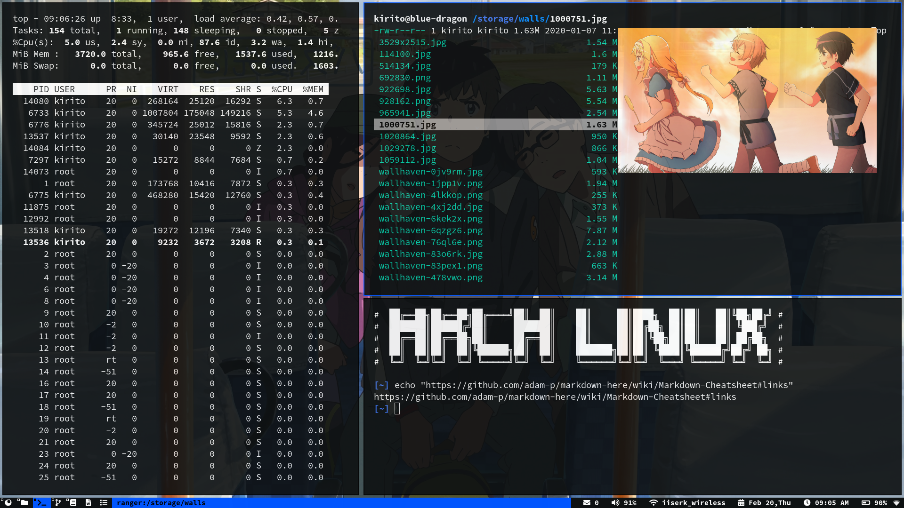

# Simple Terminal

This is my personalized build of the simple terminal [st](https://st.suckless.org/ "st home page"). It has the following [patches](https://st.suckless.org/patches/ "st patches"):

+ **externalpipe** - opening urls by filtering the terminal text and piping it into dmenu
+ **scrollback** - scrolling using keyboard
+ **mouse-scrollback** - scrolling using mouse
+ **Xresources** - defining colors and some other variables from a .Xresources which can be reloaded without recompiling st

It supports **image previews** in ranger using **w3m** (and Ueberzug).